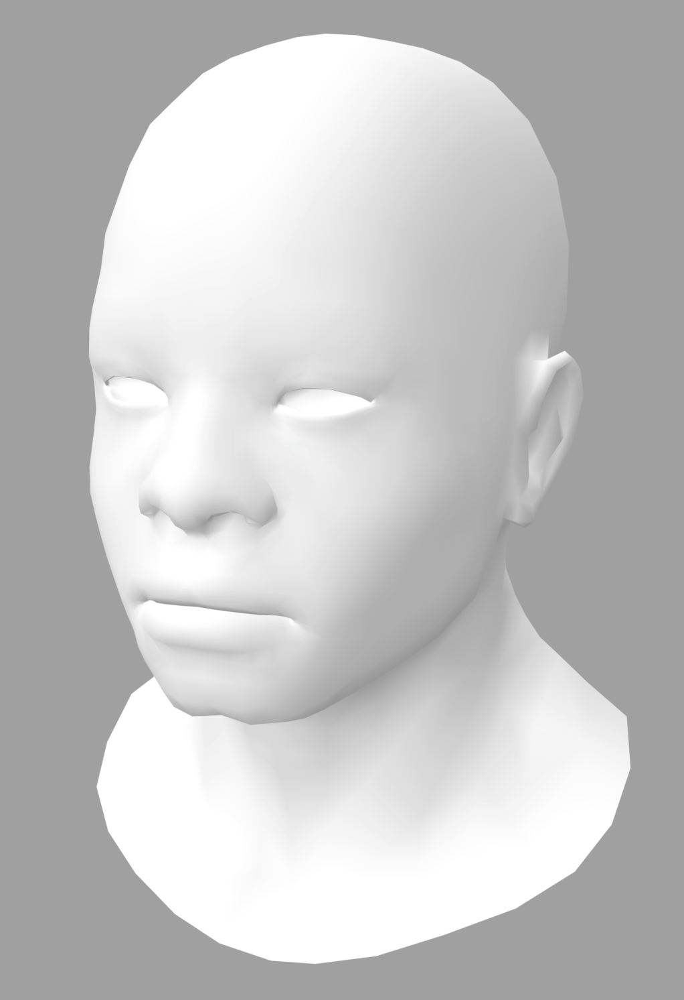
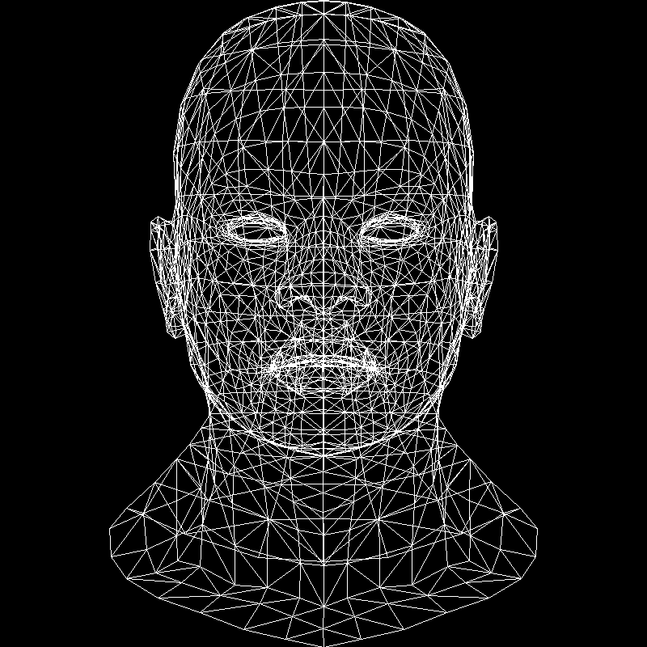
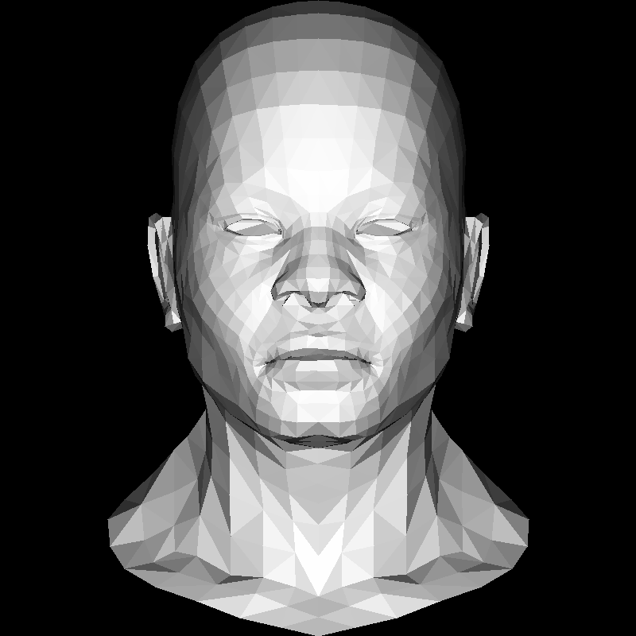
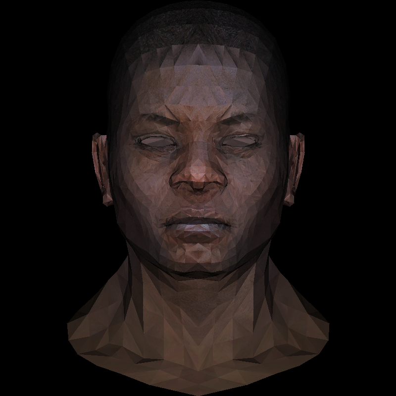
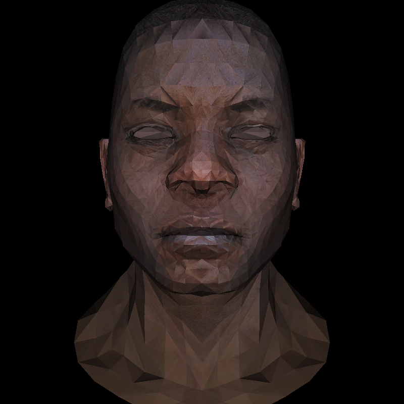

- [这个项目是什么？](#这个项目是什么)
- [tinyrenderer 知识结构](#tinyrenderer-知识结构)
- [代码索引](#代码索引)
- [效果预览](#效果预览)

# 这个项目是什么？

某天，在 B 站看了一个很不错的视频：[GAMES101 现代计算机图形学入门](https://www.bilibili.com/video/BV1X7411F744/)，恰巧又在评论区看到了一个留言，推荐了这个入门课程：[tinyrenderer](https://github.com/ssloy/tinyrenderer)，用 500 行代码一步步实现一个简单的光栅（rasterizer）图形引擎，因为我所推崇的学习方式就是多动手，比如某个项目是用 A 语言写的，我自己就用 B 或者 C 语言完全重写一遍，当你1比1写完后，基本上所以细节都知道个七七八八了。So, 我用 Python 把这个项目（C++写的）重写了一遍。

为了讲解计算机图形学最基础入门知识，原项目作者没有引入任何图形相关的外部依赖，所以作为 Python 版翻译，当然也不会引入任何外部图形 SDK。项目中生成的图片使用的 [TGA](https://en.wikipedia.org/wiki/Truevision_TGA) 格式，数据格式比较简单，这里使用的这个库：[pyTGA](https://github.com/MircoT/pyTGA)，有兴趣可以看 tga.py 代码。矩阵的计算使用的 numpy，当然也可以不引入 numpy，因为我们也只使用到最基本的矩阵计算，比如相乘。

# tinyrenderer 知识结构

  1. 3D 模型文件（本项目使用的 [obj 格式](https://en.wikipedia.org/wiki/Wavefront_.obj_file)）
  2. 根据 3D 模型生成正交投影的 2D 图像
  3. Z-Buffer
  4. 透视投影（Perspective Projection）
  5. 着色（Shader）
  6. 阴影（Shadow）
  7. 环境光（Ambient）

# 代码索引

  1. 点到线，线到面，面到体。这是光栅化的知识层次结构。要想渲染一个复杂的三维世界到二维图像，得先把基础打牢。可以思考下：
     1. 怎样在屏幕上画一条直线？[画直线的 5 中方式](test_line.py)，思考下哪个算法效率最高。
     2. 怎样画一个三角形？[两种实现方式](triangle.py)。
     3. 怎样判断一个点是否在一个三角形内？[两种算法](triangle.py)：向量的叉乘和三角重心坐标。
  2. 从 3D 模型(obj)渲染简单的线框图: [test_model_wire_mesh](test_model.py)。
  3. 从 3D 模型(obj)渲染简单的三角形填充图: [test_model_triangle](test_model.py)。
  4. 从 3D 模型(obj)渲染简单的三角形填充图, 并实现 z-buffer: [test_model_triangle_with_zbuffer](test_model.py)。
  5. 从 3D 模型(obj)渲染, 使用纹理(texture)填充: [test_model_triangle_with_texture](test_model.py)。
  6. 从 3D 模型(obj)渲染, 考虑透视视角投射: [test_model_triangle_with_perspective](test_model.py)。

# 效果预览

3D 模型：

线框图：

zbuffer：

texture：

透视：

